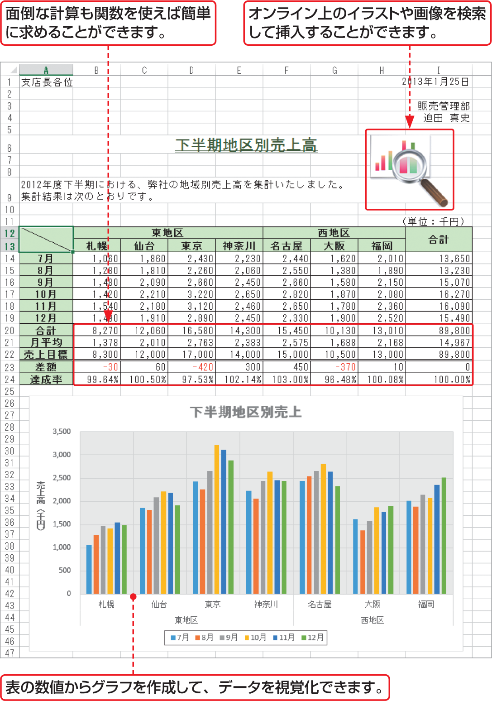

# Section 01 Excelとは？

## Excelではこんなことができる

以下の手順のとおりに実践していきましょう。

### [Memo] 数式や関数の利用

数式や関数を使うと、表のデータの合計や平均はもちろん、複雑な計算の結果も簡単に求めることができます。Excel には、大量の関数が用意されており、本書で紹介している関数はその一部です。

### [Memo] 表のデータをもとにグラフを作成

表のデータをもとに、さまざまなグラフを作成することができます。グラフのレイアウトやデザインも豊富に揃っています。もとになったデータが変更されると、グラフの内容も自動的に変更され、グラフにする範囲も簡単に変更できます。

### [Memo] デザインパーツの利用

作図機能やイラスト、画像などを挿入してさまざまな効果を設定したり、SmartArtを利用して複雑な図解を簡単に作成したりすることができます。Excel 2013では、オンライン上の画像を検索して挿入することができます。