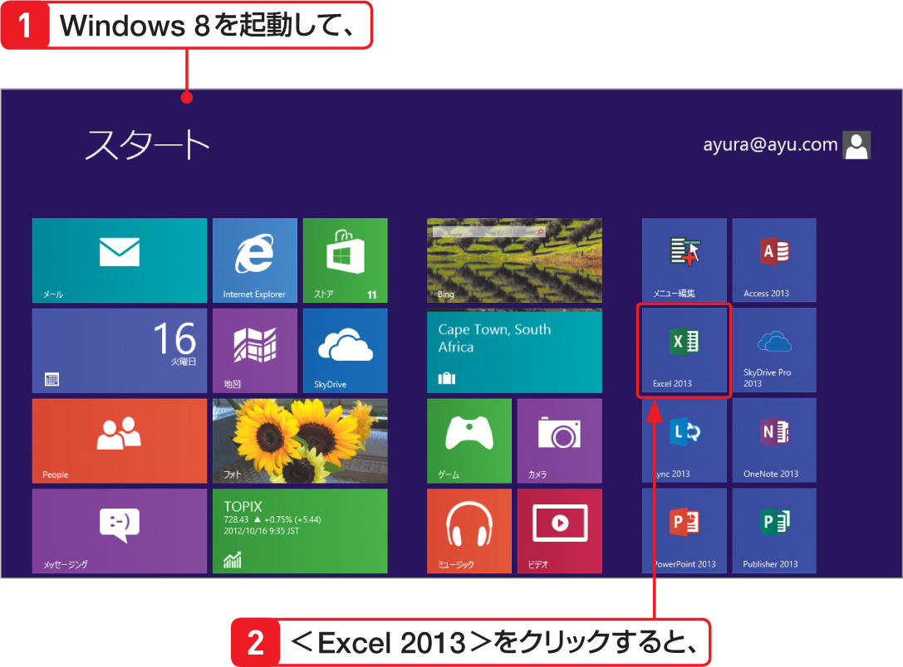

# Section 02 Excel 2013を起動・終了する

## Excel 2013を起動してブックを開く

### [New] Windows 8 でExcelを起動する

Windows 8を起動すると、＜スタート＞画面の右側に、インストールされているアプリケーションのアイコンが表示されます。表示されている＜Excel 2013＞をクリックすると、自動的にデスクトップ画面に切り替わり、Excelが起動します。
