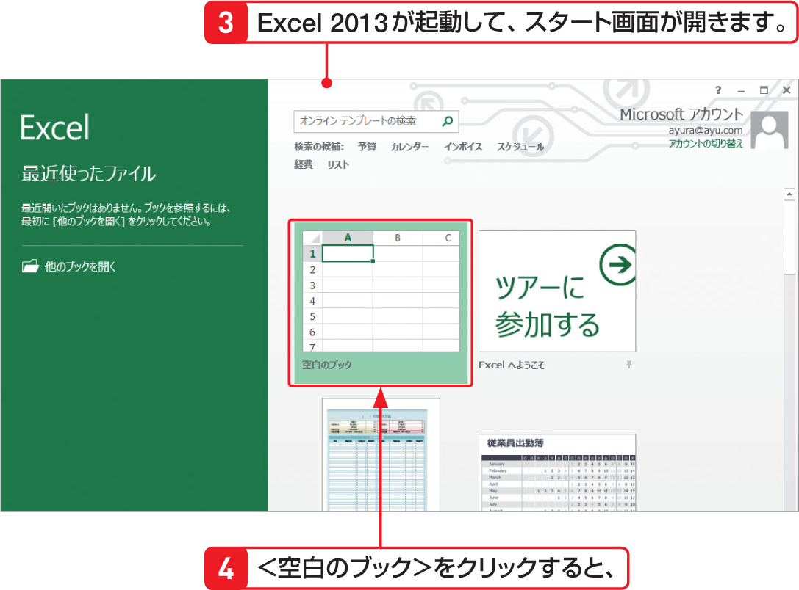
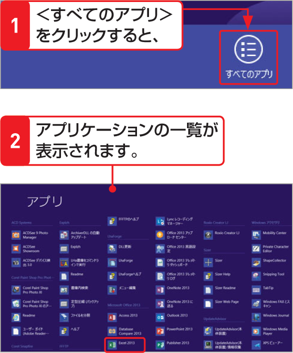

# Section 02 Excel 2013を起動・終了する

## Excel 2013を起動してブックを開く

### [Hint] ＜スタート＞画面にアイコンがない場合

＜スタート＞画面にExcelのアイコンがない場合は、＜スタート＞画面のタイル以外の何もない場所で右クリックし、＜すべてのアプリ＞をクリックします。インストールされているアプリケーションの一覧が表示されるので、＜Excel2013＞をクリックします。

