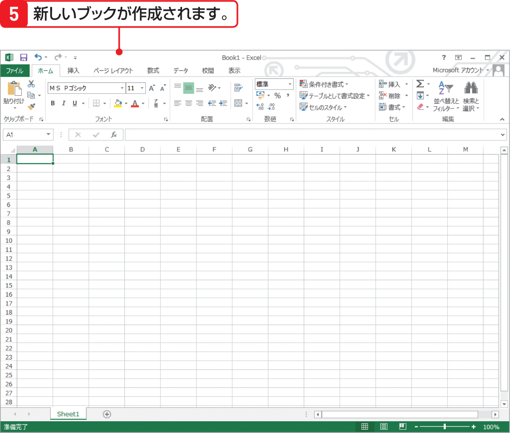

# Section 02 Excel 2013を起動・終了する

## Excel 2013を起動してブックを開く

### [New] Excel 起動時の画面

Excel 2010 までは、Excel を起動すると自動的に新しいブックが作成されました。Excel 2013 では、最近使ったブックやテンプレートが表示される「スタート画面」が表示されます。スタート画面から新しいブックを作成したり、最近使ったブックを開きます。
