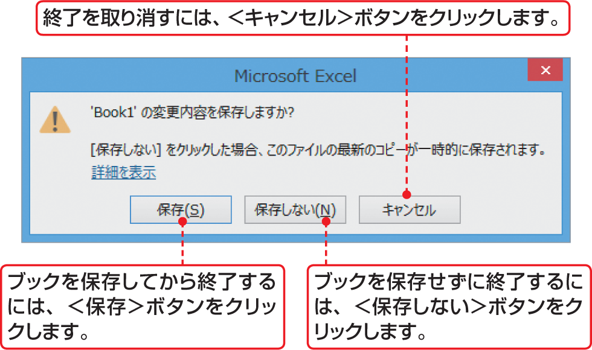

# Section 02 Excel 2013を起動・終了する

## Excel 2013を終了する

保存せずに終了したとき

### [Memo] ブックを保存していない場合

ブックの作成や編集をしていた場合に、ブックを保存しないでExcelを終了しようとすると、右図のダイアログボックスが表示されます。Excelでは、文書を保存せずに閉じた場合、4日以内であればブックを回復できます。

