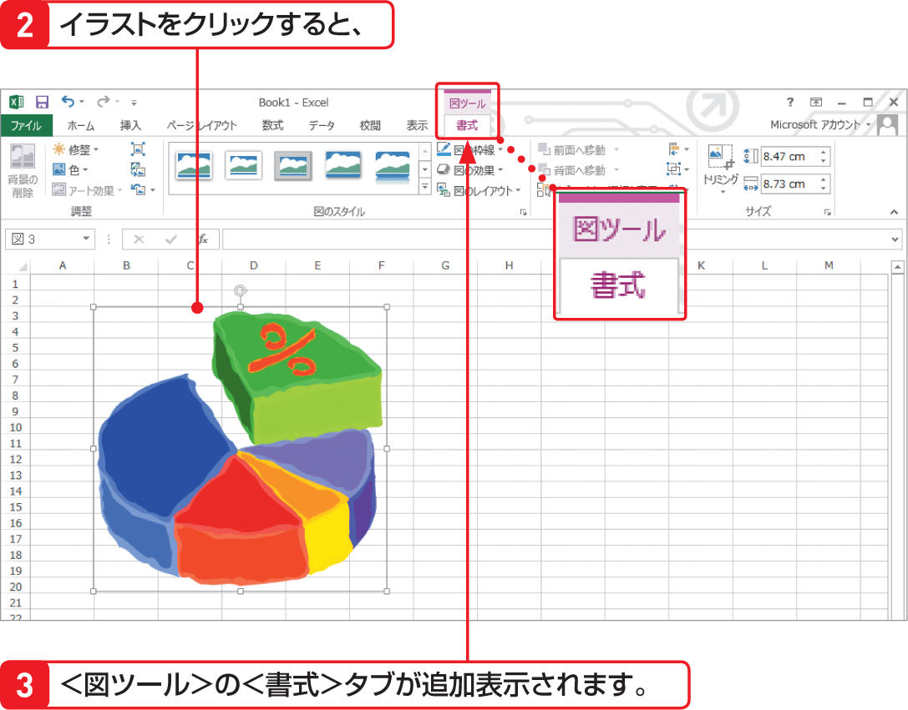

# Section 04 リボンの基本操作

## 作業に応じてタブが表示される

### [Memo] 作業に応じて表示されるタブ
作業に応じて表示されるタブには、左のほかに、グラフを作成すると表示される＜グラフツール＞の＜デザイン＞＜書式＞タブ（Sec.59参照）、ピボットテーブルを作成すると表示される＜ピボットテーブルツール＞の＜分析＞＜デザイン＞タブなどがあります（Sec.71参照）。
