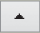
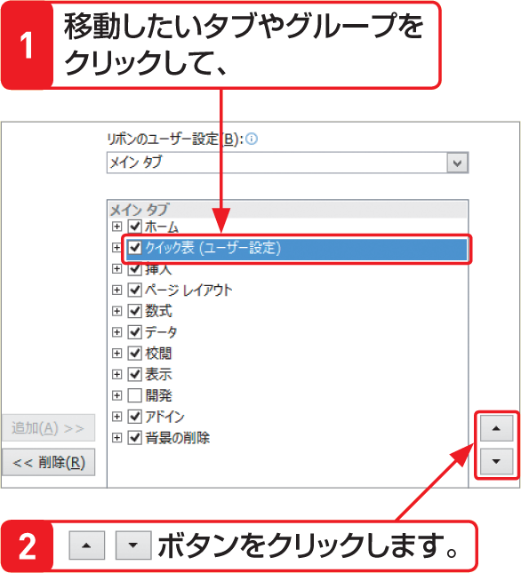

# Section 05 リボンをカスタマイズする

## オリジナルのタブを作る

### [Hint] タブやグループの並び順は変更できる
左の手順では、＜ホーム＞タブの下に新しいタブが追加されていますが、タブの順序は、ダイアログボックスの右側にある＜上へ＞ボタン  や＜下へ＞ボタン  で移動することができます。また、既存のタブやグループの順序も、同様の方法で変更することができます。

