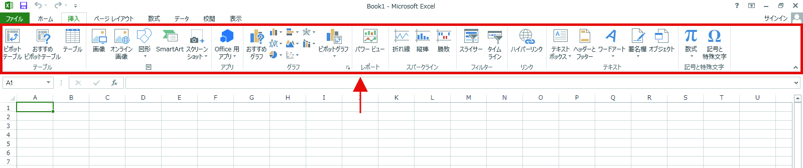
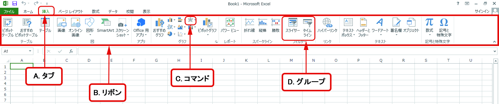

#Section04 > Step1.  
  
### 理解度チェック　01/05  
  
矢印の先の赤い枠でかこまれた部分を何というか次のA～Cから1つ選んでください。  
  
  
  
( ) A.タブ  
( ) B.リボン  
( ) C.グループ   
  
---  
  
### 答えは"B"  
  
  
  
A.タブ：8つ用意された機能の見出し  
B.リボン：タブ・コマンド・グループのまとまり  
C.コマンド：決まった機能が使えるボタン  