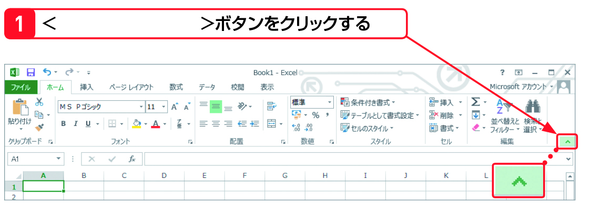
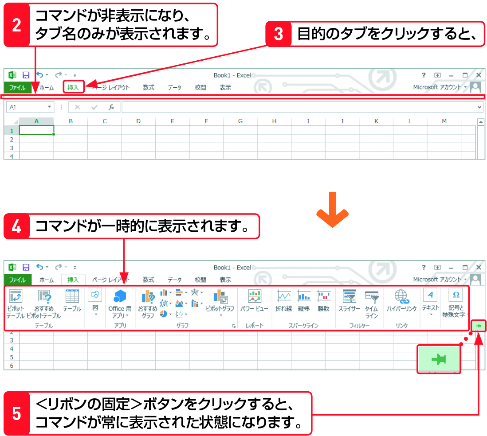

#Section04 > Step2.  
  
### 理解度チェック　02/05  
  
【1】の赤い矢印の先にあるボタンの機能を次のA～Cから1つ選んでください。  
  
  
  
( ) A.新しいブックを開く  
( ) B.リボンを折りたたむ  
( ) C.最大化する  
  
---  
  
### 答えは"B"  
  
  
  
A.新しいブックを開く：＜ファイル＞から＜新規＞  
B.リボンを折りたたむ：リボンを折りたたんでセルをたくさん表示する  
C.最大化する：画面右上の四角いボタン