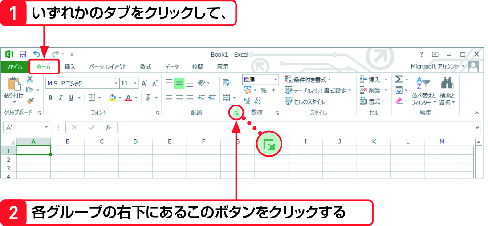
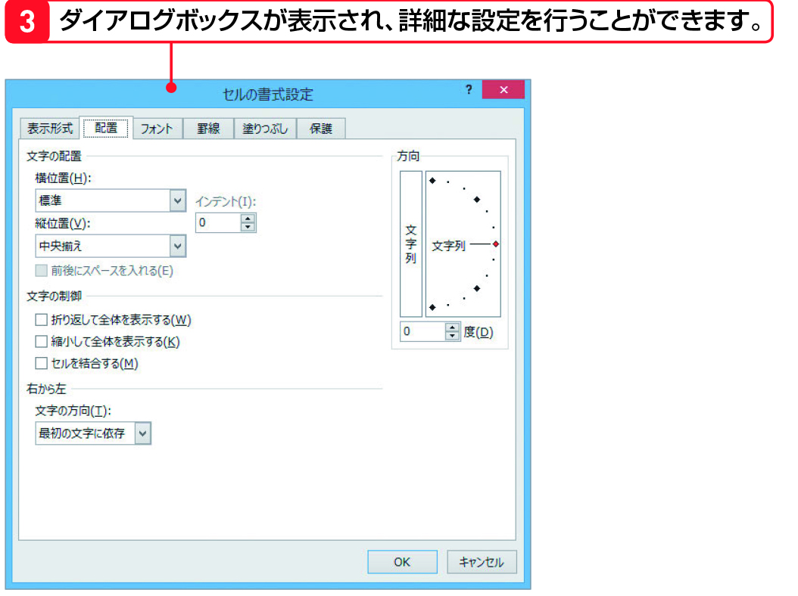

#Section04 > Step3.  
  
### 理解度チェック　03/05  
  
【2】の赤い矢印の先にある＜ダイアログボックス＞の機能を次のA～Cから1つ選んでください。  
  
  
  
( ) A.セルの書式設定  
( ) B.文字を大きくする  
( ) C.リボンを閉じる  
  
---  
  
### 答えは"A"  
  
  
  
A.セルの詳細設定：文字の配置や罫線などを設定できる  
B.文字を大きくする：＜フォントサイズ＞をクリック  
C.リボンを閉じる：＜リボンを折りたたむ＞をクリック