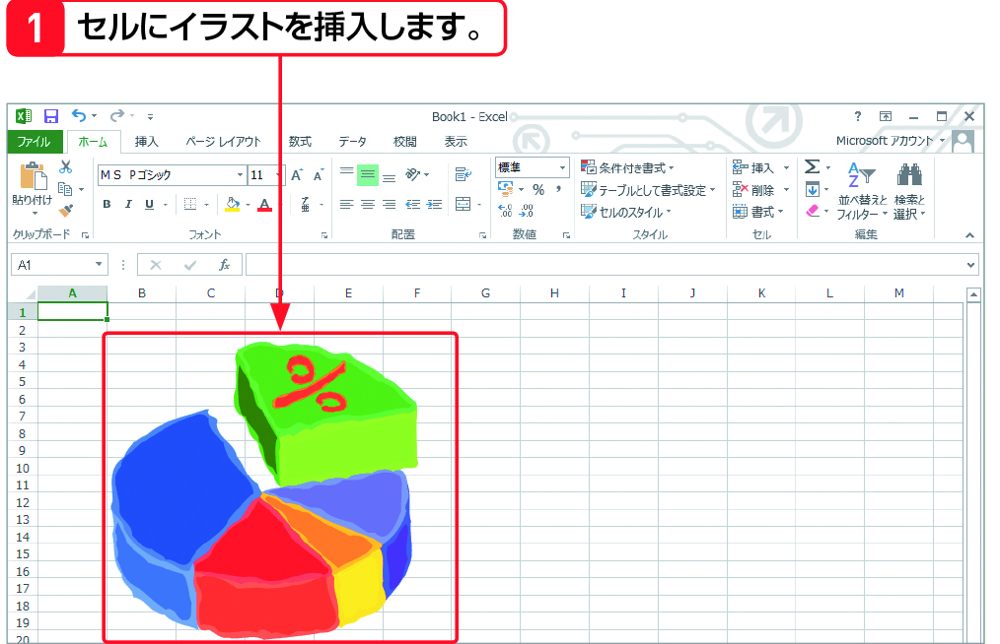
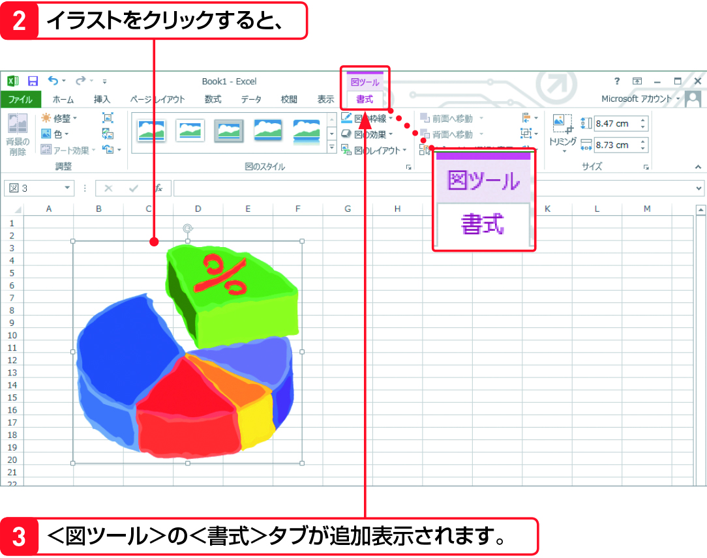

#Section04 > Step4.  
  
### 理解度チェック　04/05
  
セルにイラストを挿入すると表示される＜タブ＞を次のA～Cから1つ選んでください。  
  
  
  
( ) A.分析  
( ) B.セルの書式設定  
( ) C.書式  
  
---  
  
### 答えは"C"  
  
  
  
A.分析：ピポットテーブルを挿入すると表示される機能  
B.セルの書式設定：＜ダイアログボックス＞をクリック  
C.書式：図の枠線やレイアウトを設定できる