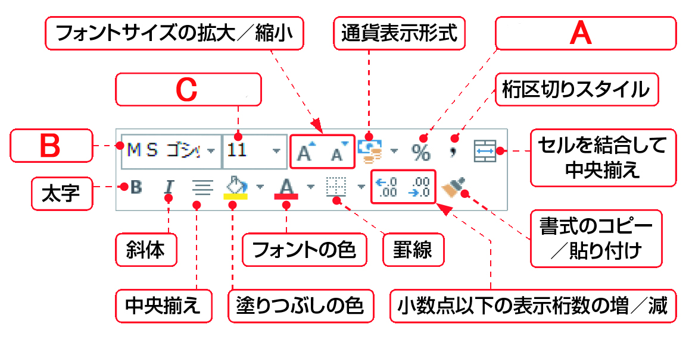
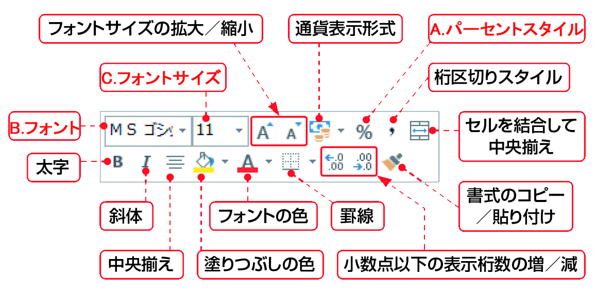

#Section04 > Step5.  
  
### 理解度チェック　05/05  
  
.ミニツールバーに表示される＜フォントサイズ＞を次のA～Cから1つ選んでください。  
  
  
  
( ) A  
( ) B  
( ) C 
  
---  
  
### 答えは"C"  
  
  
  
A.パーセントスタイル：数値をパーセントで表示する  
B.フォント：フォントの種類を変更する  
C.フォントサイズ： フォントのサイズを選んで変更する