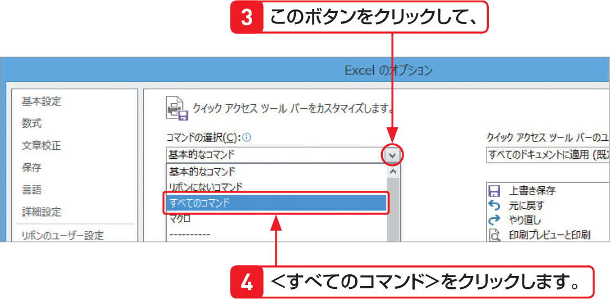

# Section 06 クイックアクセスツールバーの基本操作

## メニューやリボンに表示されていないボタンを追加する

### [Stepup] クイックアクセスツールバーを移動する

＜クイックアクセスツールバーのユーザー設定＞ボタン  をクリックして、＜リボンの下に表示＞をクリックすると、クイックアクセスツールバーがリボンの下に表示されます。元の位置に戻すには、＜クイックアクセスツールバーのユーザー設定＞ボタン  をクリックして、＜リボンの上に表示＞をクリックします。
