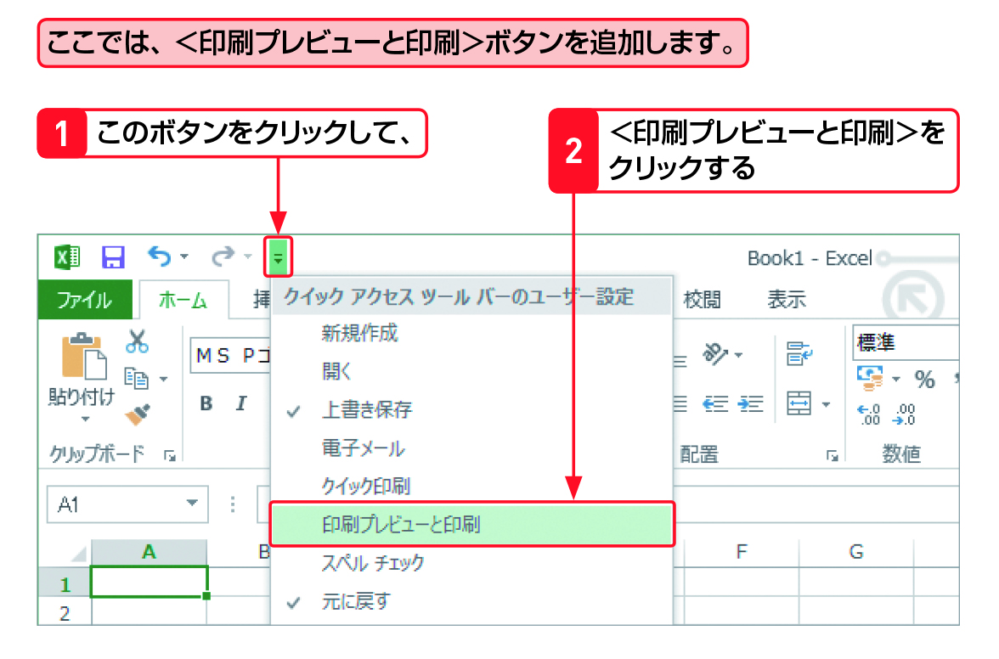

#Section06 > Step1.  
  
### 理解度チェック　01/02  
  
赤い矢印の先にあるよく使うコマンドを登録する機能を次のA～Cから1つ選んでください。  
  
  
  
( ) A.クイックアクセスツールバー  
( ) B.表示  
( ) C.オプション  
  
---  
  
### 答えは"A"  
  
  
  
A.クイックアクセスツールバー：登録するとボタンを押すだけで機能を使える  
B.表示：タブのひとつ  
C.オプション：Excelの設定を変える