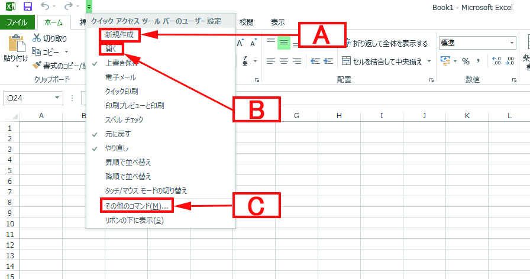
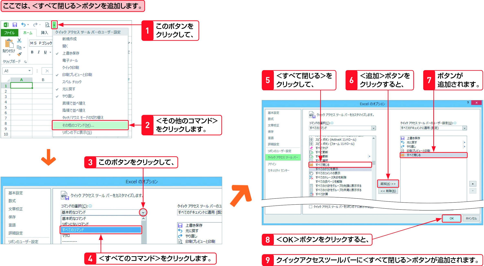

#Section06 > Step2.  
  
### 理解度チェック　02/02  
  
クイックアクセスツールバーにある、＜リボン＞にコマンドを追加する機能を次のA～Cから1つ選んでください。
  
  
  
( ) A.新規作成  
( ) B.開く  
( ) C.その他のコマンド  
  
---  
  
### 答えは"C"  
  
  
  
A.新規作成：ブックを＜新規作成＞するコマンドを追加する  
B.開く：作成済のブックを＜開く＞コマンドを追加する  
C.その他のコマンド：＜リボン＞や＜メニュー＞に表示されていないコマンドを追加する