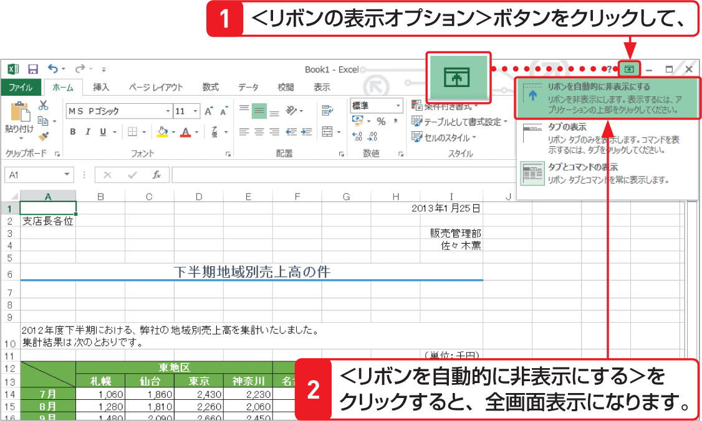

# Section 08 表示倍率を変更する

## 選択したセル範囲をウィンドウ全体に表示する

### [Stepup] 全画面表示モードの利用

Excelの画面を「全画面表示モード」にすると、タイトルバーやリボンが非表示になり、その分、ワークシートの表示領域が広くなります。Excelの画面を全画面表示にするには、画面の右上にある＜リボンの表示オプション＞ボタン  をクリックして、＜リボンを自動的に非表示にする＞をクリックします。全画面モードを解除するには、画面上部をクリックしてリボンを表示し、＜元のサイズに戻す＞ボタン  をクリックします。

