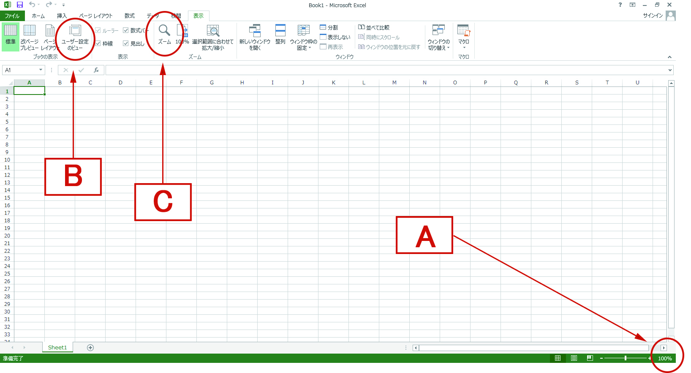
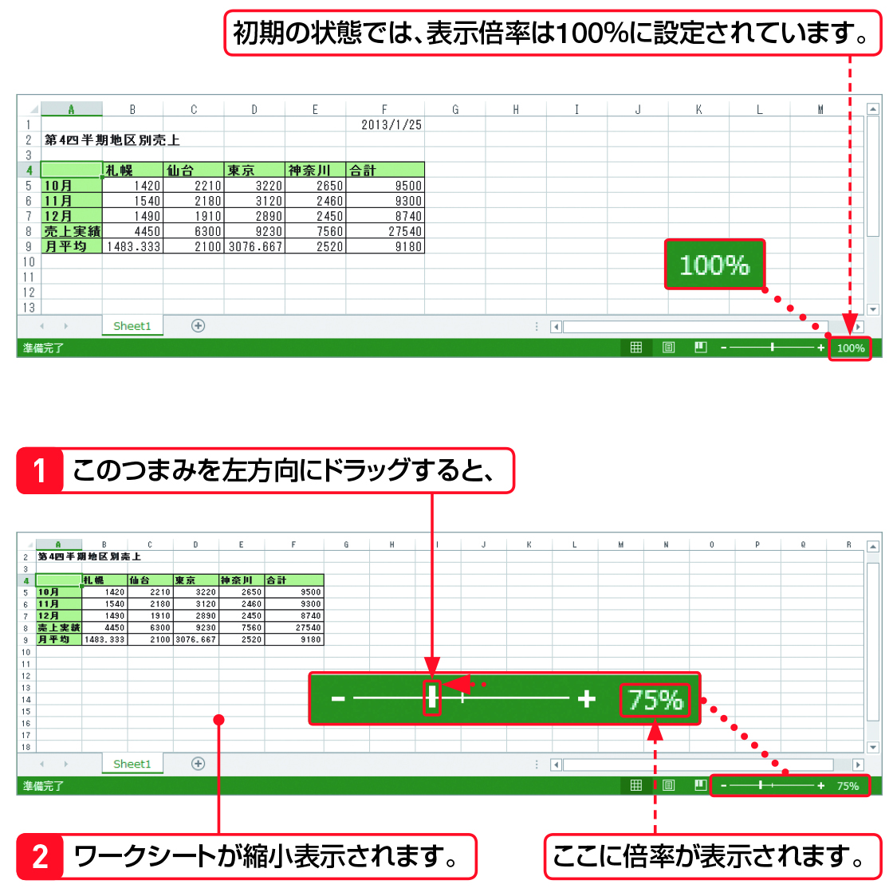

Section08 > Step1.  
  
### 理解度チェック　01/02
  
シートの文字が見えにくい時に使う機能を次のA～Cから2つ選んでください。  
  
  
  
( ) A.表示倍率を変更  
( ) B.元に戻す  
( ) C.ズーム  
  
---  
  
### 答えは"A,C"  
  
  
  
A.表示倍率を変更：セルの文字が見えにくい場合には拡大、シートを広く見たい場合は縮小する  
B.元に戻す：直前に行った操作を元に戻す  
C.ズーム：＜表示＞タブから＜ズーム＞コマンドを使用して拡大・縮小する