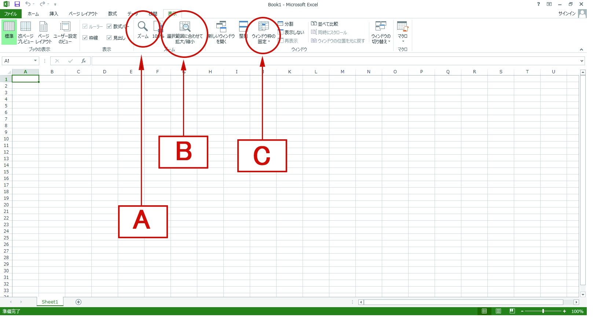
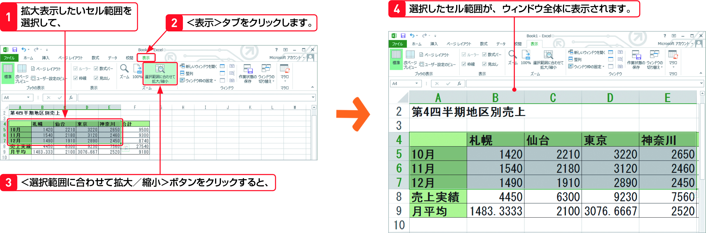

Section08 > Step2.  
  
### 理解度チェック　02/02
  
セルを選択した部分だけ拡大したい場合は、＜表示＞タブのどのコマンドを使用するか、次のA～Cから1つ選んでください。  
  
  
  
( ) A.ズーム  
( ) B.＜選択範囲に合わせて拡大/縮小＞  
( ) C.ウィンドウ枠の固定  
  
---  
  
### 答えは"B"  
  
  
  
A.ズーム：シートを拡大・縮小して表示する
B.＜選択範囲に合わせて拡大/縮小＞：セルを選択した範囲のみ拡大・縮小する
C.ウィンドウ枠の固定：スクロールしても動かないようにウィンドウを固定する