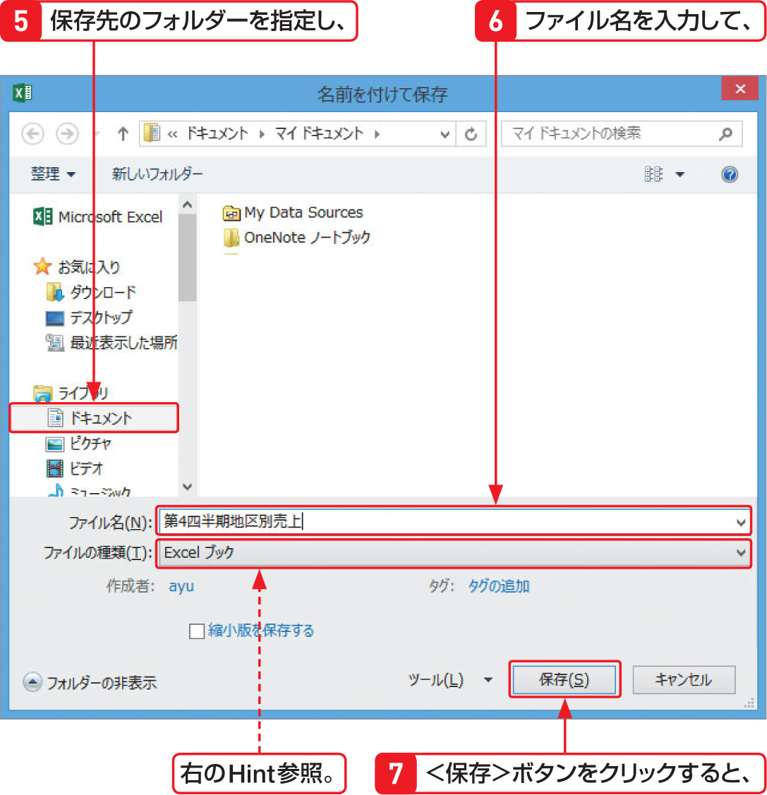
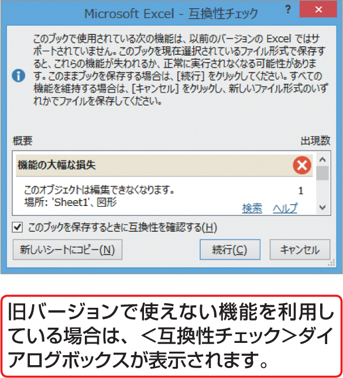

# Section 09 ブックを保存する

## ブックに名前を付けて保存する

### [Hint] 保存形式を選択する場合は

Excel 2013で作成したブックをExcel 97-2003形式やその他の形式で保存する場合は、＜名前を付けて保存＞ダイアログボックスの＜ファイルの種類＞のボタンをクリックし、一覧から選択します。なお、Excel 2013 で作成したブックをExcel 97-2003形式で保存する際、旧バージョンで使えない機能を利用している場合は、＜互換性チェック＞ダイアログボックスが表示されます。内容を確認して対処してください。

