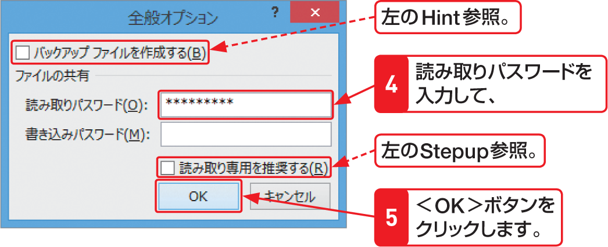

# Section 09 ブックを保存する

## ブックにパスワードを設定する

### [Hint] バックアップファイルを作成するには？

「バックアップファイル」とは、ブックを上書き保存する際に、元のブックの内容を別のファイルとして残したもののことです。上書き保存時にバックアップファイルを作成するには、＜全般オプション＞ダイアログボックスの＜バックアップファイルを作成する＞にチェックを付けます。
