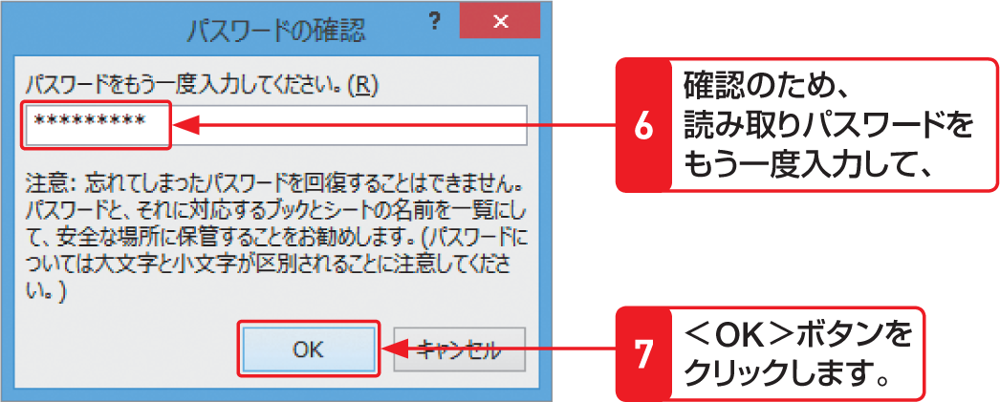

# Section 09 ブックを保存する

## ブックにパスワードを設定する

### [Stepup] 読み取り専用モードで保存する

＜全般オプション＞ダイアログボックスの＜読み取り専用を推奨する＞にチェックを付けると、ブックは読み取り専用モードで保存されます。読み取り専用モードで保存したブックは、次に開いた人が編集したり変更したりすることはできません。

### [Hint] パスワードを解除するには？

パスワードが設定されたブックを開いて、右の方法で＜全般オプション＞ダイアログボックスを表示します。設定したパスワードを削除して、＜OK＞ボタンをクリックすると、パスワードが解除できます。
