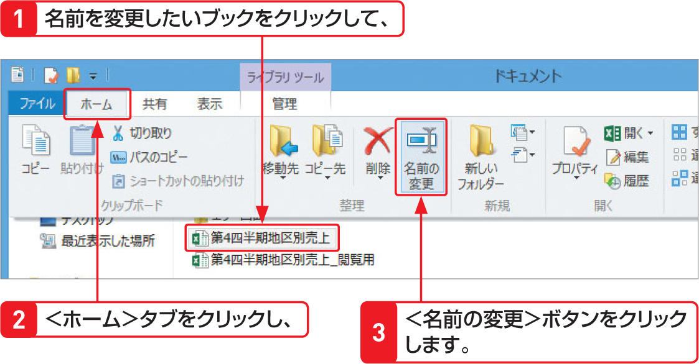

# Section 09 ブックを保存する

## ブックにパスワードを設定する

### [Hint] 保存後にファイル名を変更するには？
ブックに付けたファイル名を後から変更するには、タスクバーの＜エクスプローラー＞アイコン  をクリックして、エクスプローラー画面を表示します。保存先のフォルダーを開いて、ブックをクリックし、＜ホーム＞タブの＜名前の変更＞ボタンをクリックすると、ファイル名が入力できる状態になります。
また、名前を変更したいブックを右クリックすると表示されるショートカットメニューから＜名前の変更＞をクリックしても、ファイル名が入力できる状態になります。ただし、どちらの方法も、ブックが開かれていると変更できません。

