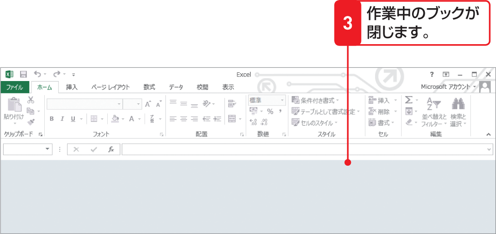
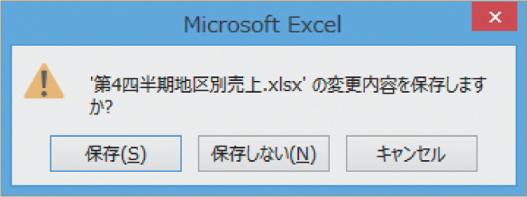

# Section 10 ブックを閉じる

## 保存したブックを閉じる

### [Memo]変更を保存していない場合

変更を加えたブックを上書き保存しないで閉じようとすると、下図のようなダイアログボックスが表示されます。ブックの変更を保存して閉じる場合は＜保存＞を、変更を保存しないで閉じる場合は＜保存しない＞を、閉じずに作業に戻る場合は＜キャンセル＞ボタンをそれぞれクリックします。

