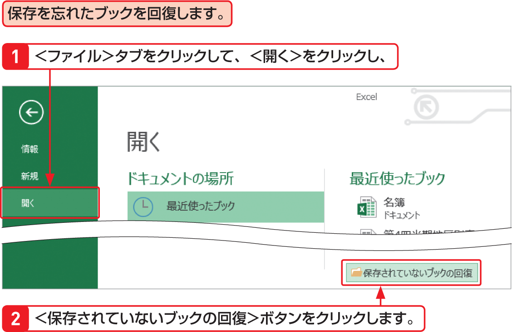

# Section 10 ブックを閉じる

## 保存したブックを閉じる

保存し忘れたブックを回復することができます。

### [Stepup]保存せずに閉じたブックを回復する

Excelでは、作成したブックや編集内容を保存せずに閉じた場合、4日以内であればブックを回復することができます。この機能を有効にするには、＜Excelのオプション＞ダイアログボックスの＜保
存＞で、＜次の間隔で自動回復用データを保存する＞にチェックを付けて保存する間隔を指定し、＜保存しないで終了する場合、最後に自動保存されたバージョンを残す＞にチェックが付いている必要があります（初期設定では付いています）。

