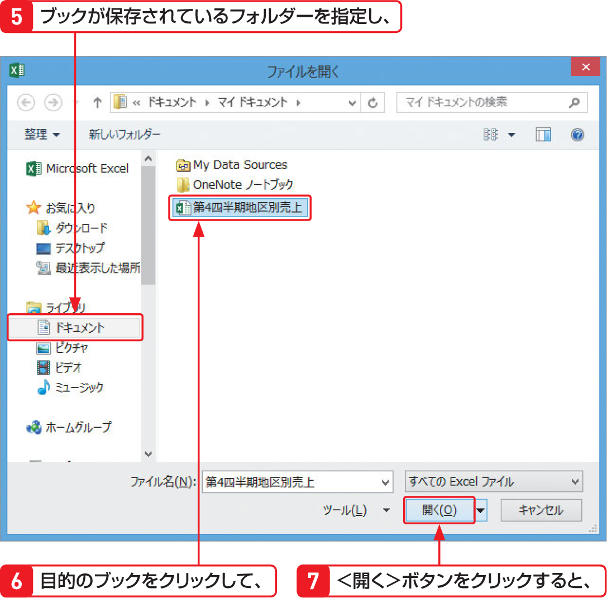
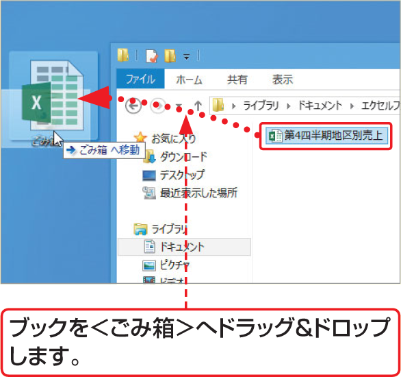

# Section 11 ブックを開く

## 保存してあるブックを開く

### [Hint]ブックを削除するには？

保存してあるブックを削除するには、保存先のフォルダーを開いて、目的のブックを＜ごみ箱＞へドラッグ＆ドロップします。あるいは、ブックを右クリックすると表示されるショートカットメニューから＜削除＞をクリックし、確認のダイアログボックスで＜はい＞ボタンをクリックします。ただし、ブックが開かれていると削除できません。

