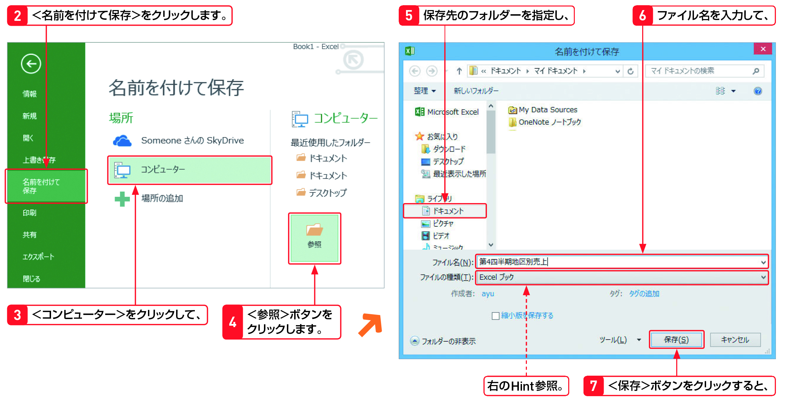

Section09 > Step1.  
  
### 理解度チェック　01/03
  
新しく作成したブックを保存する機能を次のA～Cから1つ選んでください。  
  
  
  
( ) A.新規  
( ) B.上書き保存  
( ) C.名前を付けて保存  
  
---  
  
### 答えは"C"  
  
  
  
A.新規：新しいブックを作成する  
B.上書き保存：作成中のブックに上書きして保存する  
C.名前を付けて保存：作成中のブックに名前を付けて新しく保存する