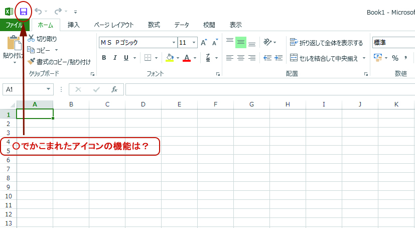
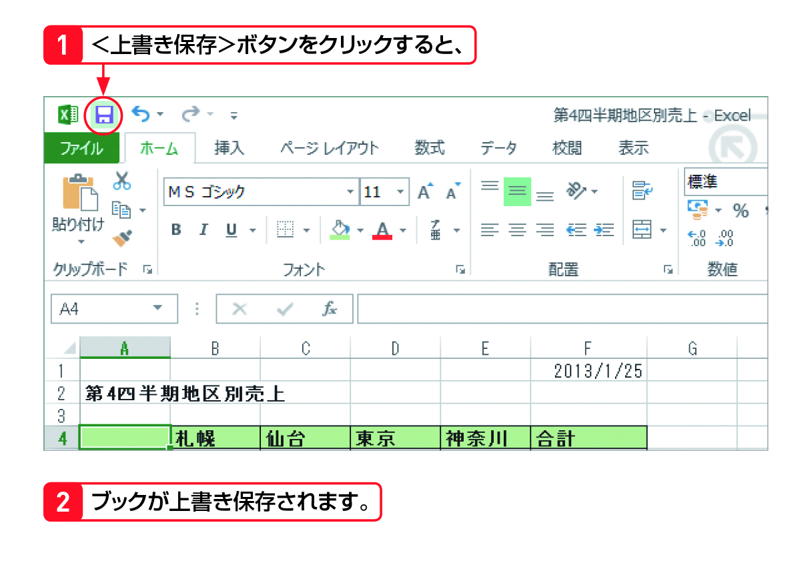

#Section09 > Step2.  
  
### 理解度チェック　02/03  
  
赤い矢印の先にある機能を次のA～Cから1つ選んでください。  
  
  
  
( ) A.開く  
( ) B.上書き保存  
( ) C.閉じる  
  
---  
  
### 答えは"C"  
  
  
  
A.開く：＜ファイル＞からブックを開く  
B.上書き保存：作成しているブックに保存する  
C.閉じる：＜ファイル＞からブックを閉じる