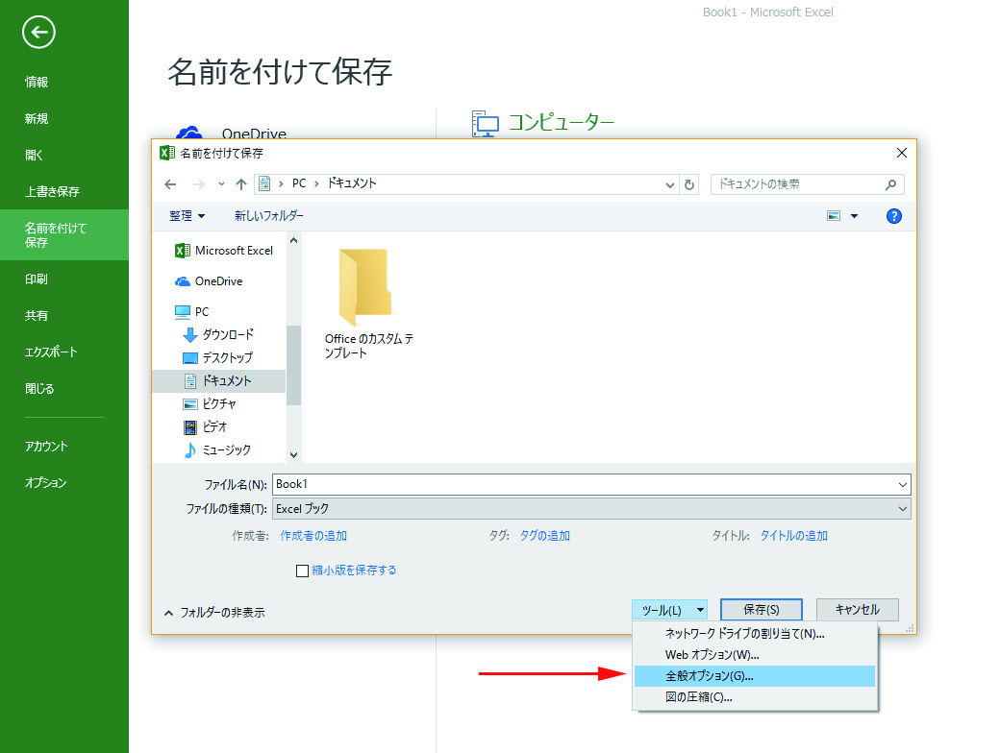
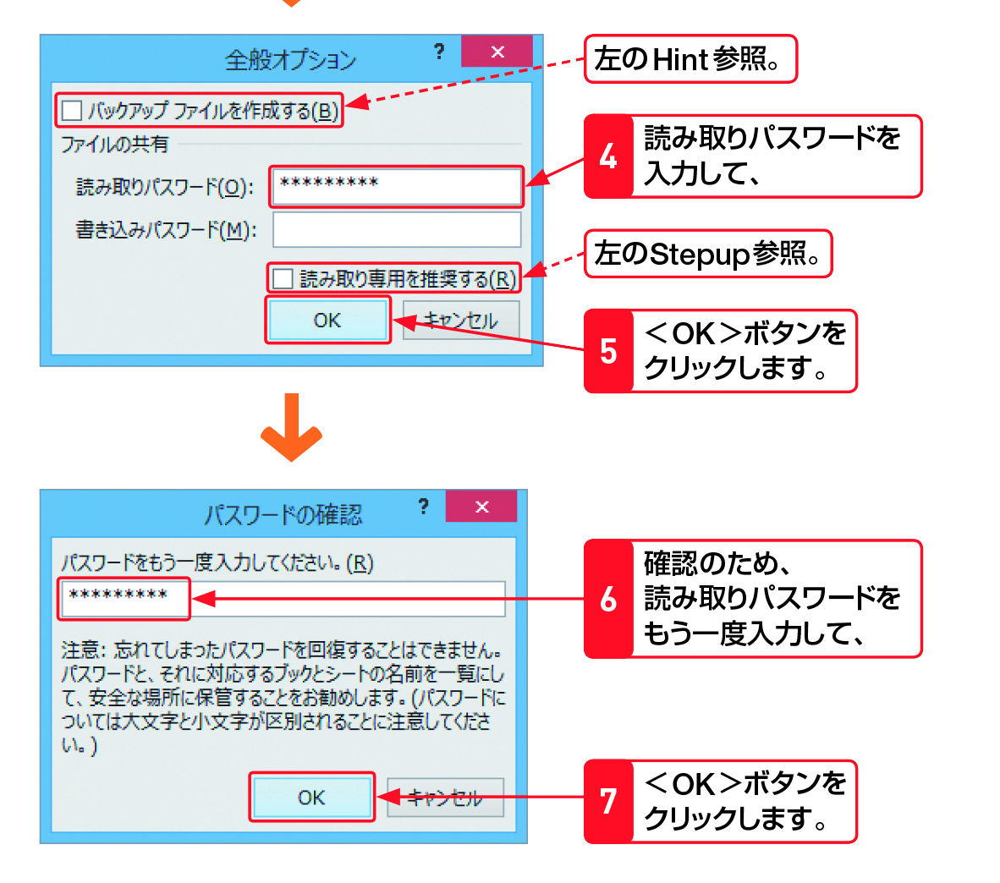

#Section09 > Step3.  
  
### 理解度チェック　03/03
  
＜全般オプション＞は主にどんな時に使う？  
  
  
  
( ) A.パスワード設定する  
( ) B.ブックの名前を変更する  
( ) C.Excelの設定を変更する  
  
---  
  
### 答えは"A"  
  
  
  
A.パスワード設定する：ブックにパワードを設定する  
B.ブックの名前を変更する：名前の変更はファイルを右クリックして＜名前の変更＞  
C.Excelの設定を変更する：設定を変更するのは＜ファイル＞から＜設定＞