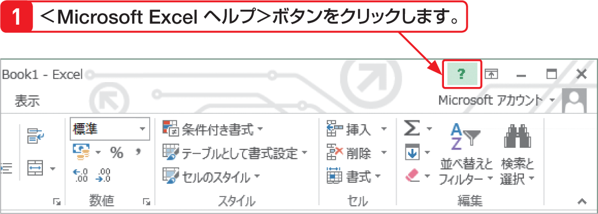

# Section 12 操作に困ったときは？

## ＜Excelヘルプ＞ウィンドウを利用する

### [New] Excel ヘルプ

Excel 2013の＜Excelヘルプ＞ウィンドウには、次の検索方法が用意されています。  
&#9312; 検索ボックスにキーワードを入力する  
&#9313; ＜人気の検索キーワード＞を利用する  
&#9314; ＜製品を使ってみる＞に用意されている項目を利用する  
&#9315; ＜無料のオンライントレーニングでスキルを磨く＞に用意されている項目を利用する  
&#9316; ＜その他＞をクリックすると表示されるOffice.com を利用する
