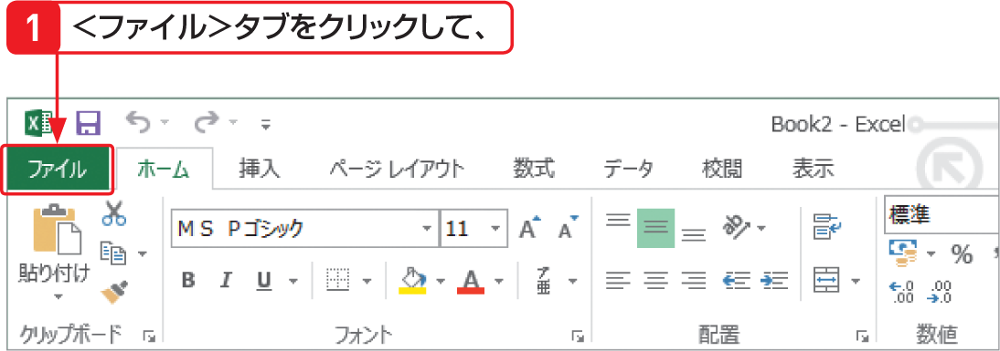

# Section 13 新しいブックを作成する

## テンプレートからブックを作成する

### [Keyword] テンプレート

「テンプレート」とは、ブックを作成する際にひな形となるファイルのことです。書式設定や計算式などがすべて設定されているので、すぐに利用することができます。Excel 2013には、以下のカテゴリに分かれた多数のテンプレートが用意されています。

&#9312; 予算  
&#9313; カレンダー  
&#9314; インボイス  
&#9315; スケジュール  
&#9316; 経費  
&#9317; リスト  
