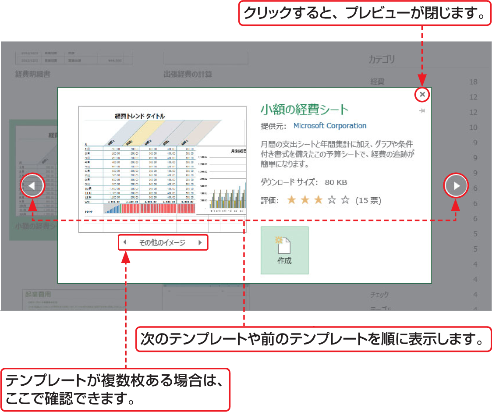

# Section 13 新しいブックを作成する

## テンプレートからブックを作成する

### [Hint] テンプレートのプレビュー

目的のテンプレートをクリックすると、手順  のようにプレビューが表示されるので、内容を確認できます。また、左右の矢印ボタンをクリックすると、次のテンプレートや前のテンプレートを順に表示することができます。  
プレビューを閉じるには、プレビュー画面右上にある＜閉じる＞ボタン  をクリックします。

