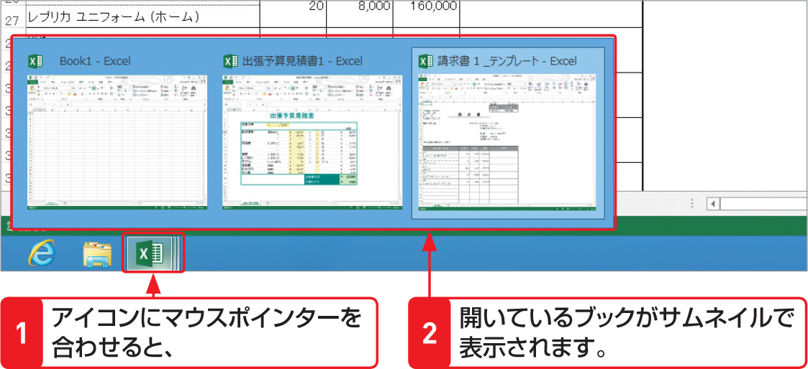

# Section 13 新しいブックを作成する

## テンプレートからブックを作成する

### [Memo] タスクバーのアイコンでブックを切り替える

Excelで複数のブックを開いた状態で、タスクバーのアイコンにマウスポインターを合わせると、開いているブックがサムネイル（画面の縮小版）で表示されます。そのなかの1つにマウスポインターを合わせると、その画面がプレビュー表示されます。開きたいブックのサムネイルをクリックすると、ブックを切り替えることができます。  
なお、サムネイルの右上に表示されている  ボタンをクリックすると、そのブックが閉じます。

