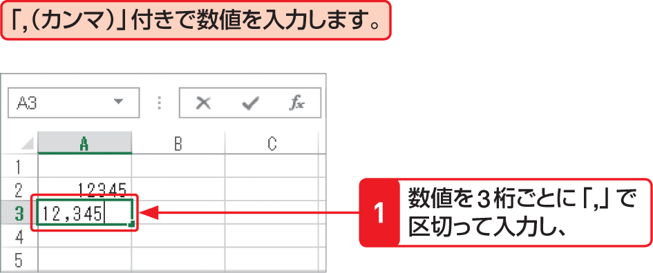

# Section 14 データ入力の基本

## 「,」や「&yen;」、「&#37;」付きの表示形式で数値を入力する

### [Memo] 「,（カンマ）」を付けて入力すると…

数値を3桁ごとに「,」（カンマ）で区切って入力すると、記号なしの＜通貨＞スタイルが自動的に設定されます。また、数字だけを入力して＜ホーム＞タブの＜数値＞にある＜桁区切りスタイル＞ボタン をクリックすると、「,」（カンマ）が入力され、＜通貨＞スタイルが設定されます。
