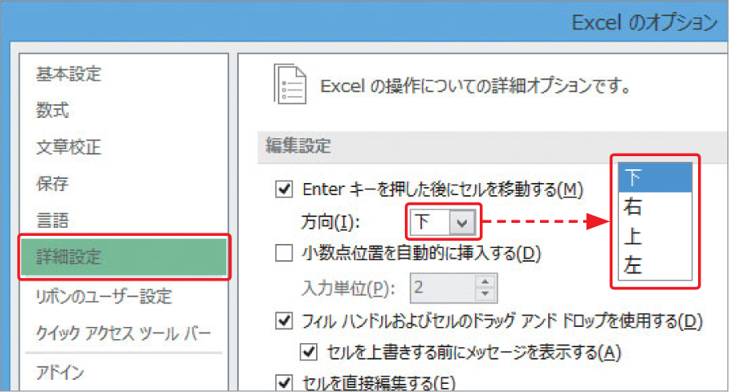

# Section 14 データ入力の基本

## 「,」や「&yen;」、「&#37;」付きの表示形式で数値を入力する

### [Stepup] アクティブセルの移動方向を変更する

[key: Enter]キーを押して入力を確定したときに、アクティブセルが移動する方向を変更するには、＜ファイル＞タブをクリックして、＜オプション＞をクリックします。  
＜Excelのオプション＞ダイアログボックスが表示されるので、＜詳細設定＞をクリックして、＜方向＞の  ボタンをクリックして表示される一覧から、アクティブセルを移動させたい方向を選択します。

