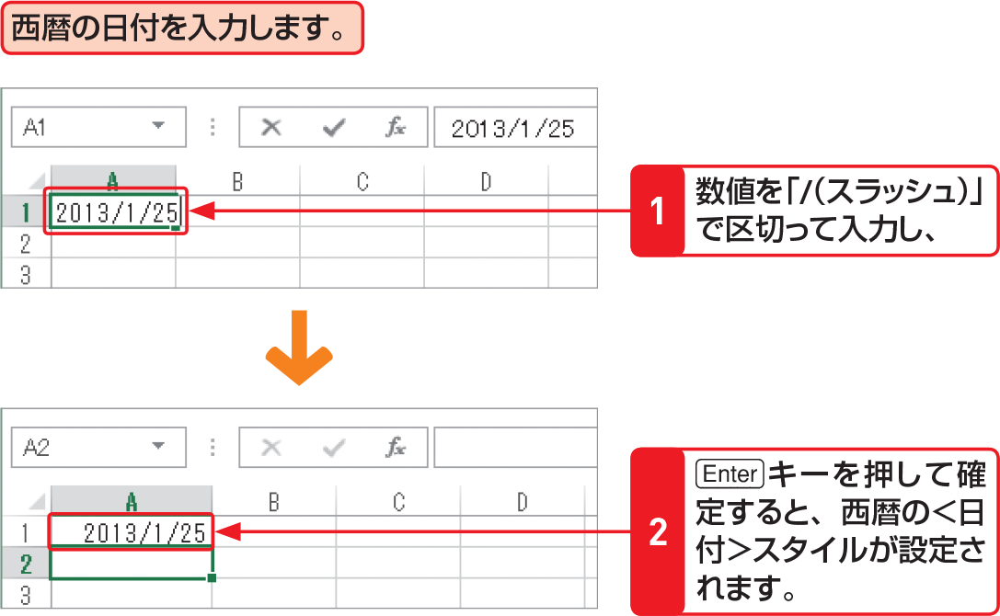

# Section 14 データ入力の基本

## 日付の表示形式で入力する

### [Memo] 日付や時刻の入力

「年、月、日」を表す数値を、西暦の場合は「/（スラッシュ）」や「-（ハイフン）」、和暦の場合は先頭に年号を表す記号を付けて「.（ピリオド）」で区切って入力すると、自動的に＜日付＞の表示形式が設定されます。  
同様に、「時、分、秒」を表す数値を「:（コロン）」で区切って入力すると、自動的に＜時刻＞の表示形式が設定されます。