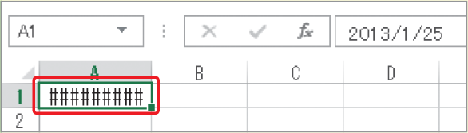

# Section 14 データ入力の基本

## 日付の表示形式で入力する

### [Hint] 「&#035;&#035;&#035;&#035;」が表示される場合は？

これは、列幅が不足している場合のエラー表示です。列幅をユーザーが変更していない場合には、データを入力すると自動的に列幅が調整されますが、すでに列幅を変更していてその列幅が不足している場合は、この表示が現れます。列幅を手動で調整すると、データが正しく表示されます（Sec.35参照）。

