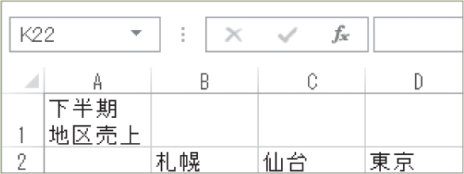

# Section 14 データ入力の基本

## 日付の表示形式で入力する

数値は全角で入力しても、自動的に半角に変換されます。ただし、文字列の一部として入力した数値は、そのまま全角で入力されます。

### [Stepup] セル内で文字列を改行するには？

セルの幅よりも長い文字列を入力したときは、左下段図の「A1」セルのように、右のセルにはみ出して表示されます。セル内に文字列を収めたい場合は、セル内で改行します。セル内で文字列を改行するには、目的のセルをダブルクリックして、改行したい位置にカーソルを移動し、[key: Alt] ＋ [key: Enter]キーを押します。

