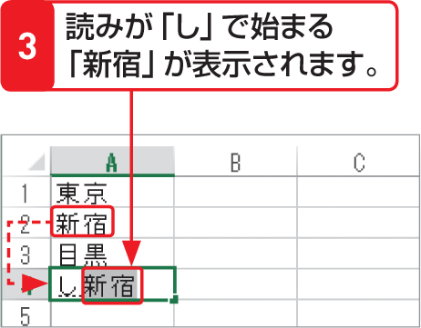
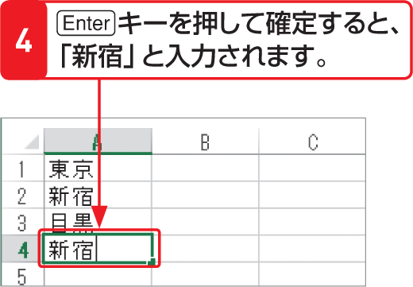

# Section 15 同じデータを入力する

## 同じ列にある文字列を入力する

### [Hint] 予測候補の表示

Windowsに付属の日本語入力ソフト「Microsoft IME」では、読みを数文字入力すると、その読みに該当する候補が表示されます。また、同じ文字列を何度か入力して確定させると、その文字列が履歴として記憶され、変換候補として表示されます。この機能を「予測入力」といいます。

