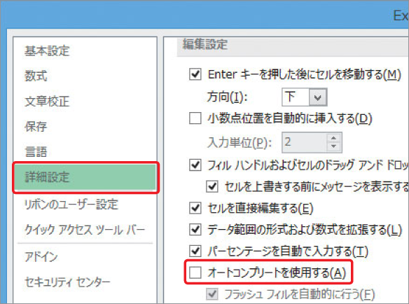

# Section 15 同じデータを入力する

## 同じ列にある文字列を一覧から選択して入力する

### [Hint] オートコンプリートをオフにするには？

オートコンプリートを使用しない場合は、＜ファイル＞タブをクリックして＜オプション＞をクリックします。＜Excelのオプション＞ダイアログボックスが表示されるので、＜詳細設定＞をクリックして、＜オートコンプリートを使用する＞のチェックを外します。

