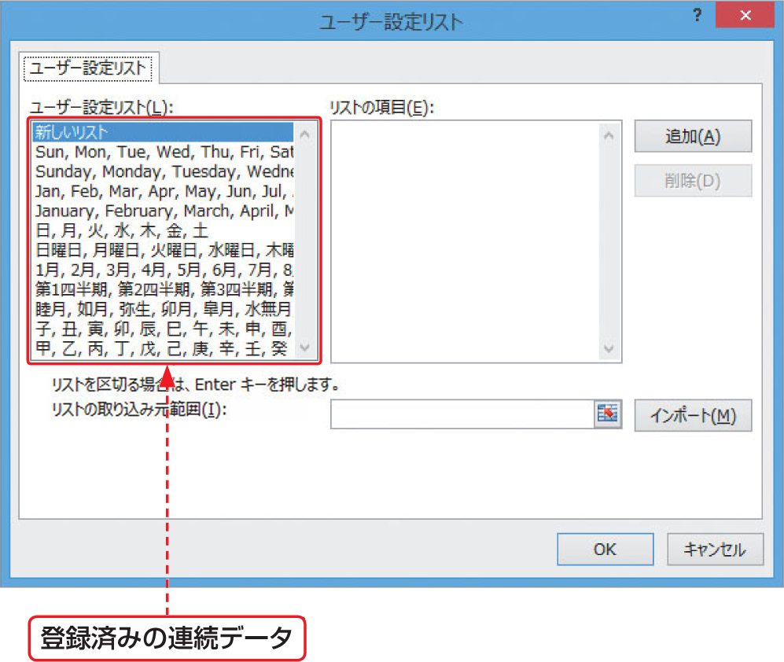

# Section 16 連続したデータを入力する

## 連続するデータを入力する

### [Stepup] 登録済みの連続データ

あらかじめ登録されている連続データとみなされるデータは、＜ユーザー設定リスト＞ダイアログボックスで確認することができます。  
＜ユーザー設定リスト＞ダイアログボックスは、＜ファイル＞タブをクリックし、＜オプション＞をクリックして、＜Excelのオプション＞ダイアログボックスを表示します。続いて、＜詳細設定＞をクリックし、＜全般＞グループの＜ユーザー設定リストの編集＞ボタンをクリックすると表示されます。

