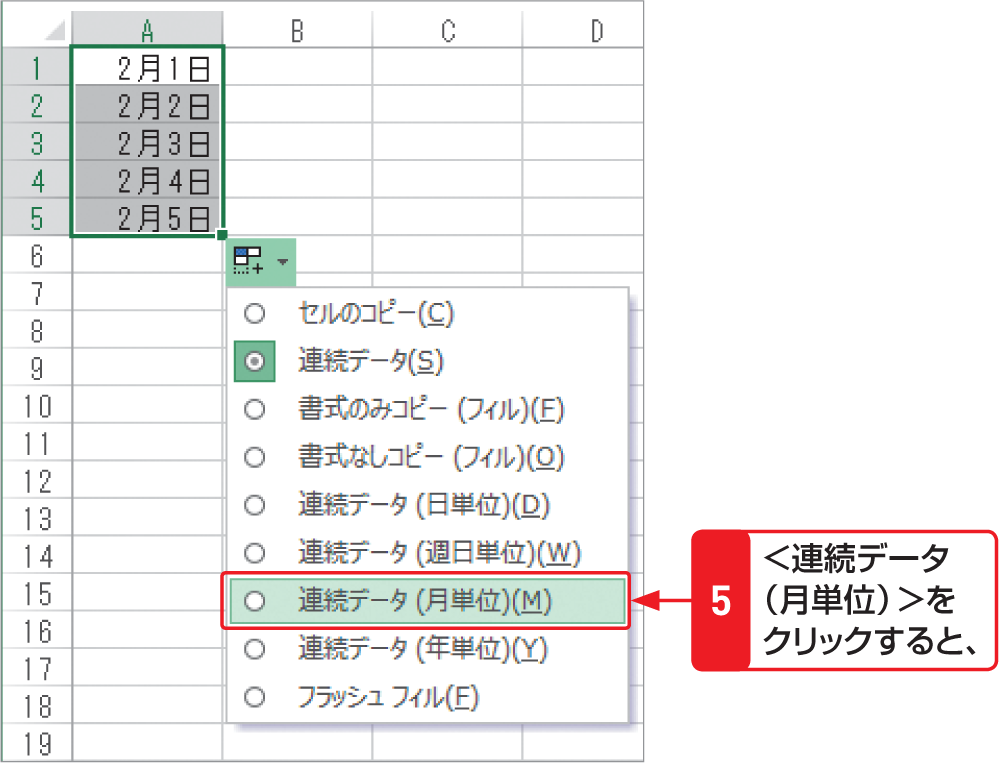

# Section 16 連続したデータを入力する

## 間隔を指定して日付データを入力する

### [Memo] 日付の間隔の選択

オートフィルを利用して日付の連続データを入力した場合、＜オートフィルオプション＞ボタン  をクリックして表示される一覧から日付の間隔を選択することができます。選択できる間隔は、次のとおりです。

&#9312; 日単位  
&emsp;日付が連続して入力されます。  
&#9313; 週日単位  
&emsp;日付が連続して入力されますが、土日が除かれます。  
&#9314; 月単位  
&emsp;「1月1日」「2月1日」「3月1日」…のように、月が連続して入力されます。  
&#9315; 年単位  
&emsp;「2013/1/1」「2014/1/1」「2015/1/1」…のように、年が連続して入力されます。
