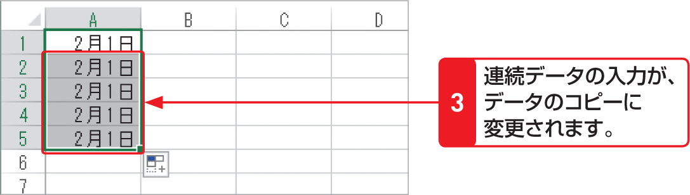
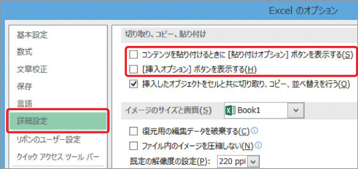

# Section 16 連続したデータを入力する

## オートフィルの動作を変更して入力する

### [Stepup] ＜オートフィルオプション＞を利用しない場合は？

＜オートフィルオプション＞ボタンが表示されないように設定することもできます。＜ファイル＞タブをクリックして、＜オプション＞ をクリックします。＜Excelのオプション＞ダイアログボックスが表示されるので、＜詳細設定＞をクリックし、＜コンテンツを貼り付けるときに［貼り付けオプション］ボタンを表示する＞と＜［挿入オプション］ボタンを表示する＞のチェックを外します。

