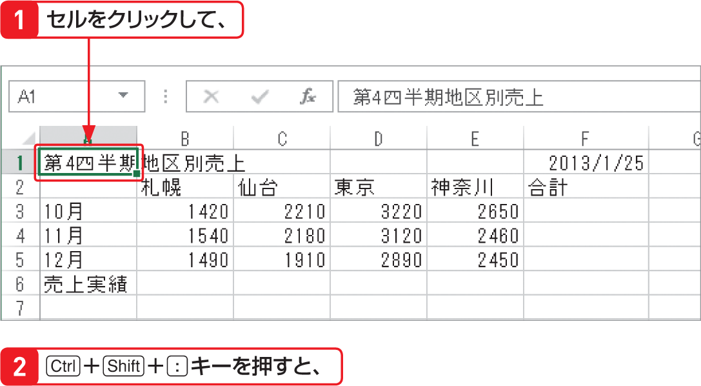

# Section 18 セル範囲を選択する

## アクティブセル領域を選択する

### [Memo] アクティブセル領域の選択

アクティブセルを含む、データが入力された矩形（長方形）のセル範囲のことを「アクティブセル領域」といいます。アクティブセル領域の選択は、データが入力された領域にだけ書式を設定したい場合などに便利です。ただし、間に空白の行や列があると、そこから先のセル範囲は選択されないので注意が必要です。
