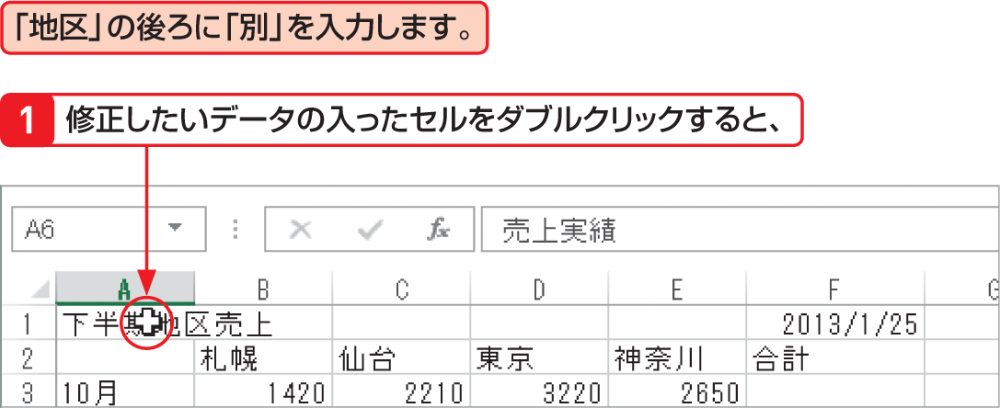

# Section 17 データを修正する

## セル内のデータの一部を修正する

### [Memo] データの一部の修正

セル内のデータの一部を修正するには、目的のセルをダブルクリックして、セル内にカーソルを表示します。その状態で、入力時と同様にデータを編集することができます。[key: Delete]キーや[key: BackSpace]キーを押すと、データの一部を削除できます。なお、ダブルクリックしたとき、目的の位置にカーソルが表示されていない場合は、セル内をクリックするか[key: ←]や[key: →]キーを押して、カーソルを移動します。
