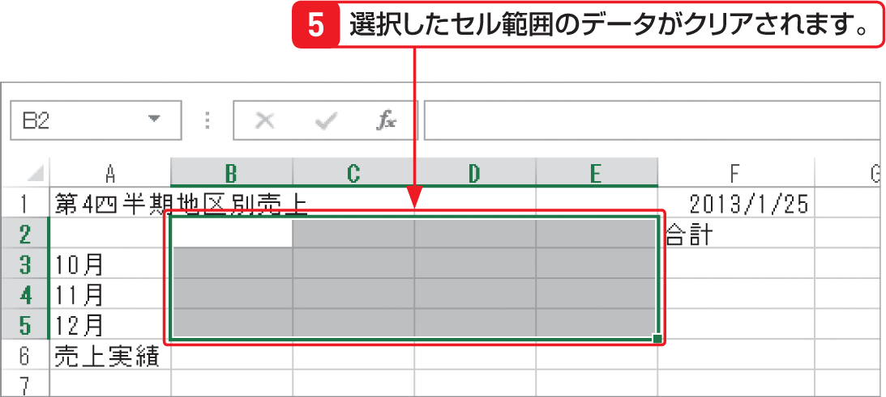

# Section 17 データを修正する

## セルのデータをクリアする

### [Memo] セルのデータをクリアする

「クリア」とは、セルの数式や値、書式を消す操作で、行や列、セルはそのまま残ります。なお、セル内のデータをクリアするには、左の手順の他、クリアしたいセルを選択して、[key: Delete]キーを押すか、セルを右クリックすると表示されるメニューから＜数式と値のクリア＞をクリックします。
