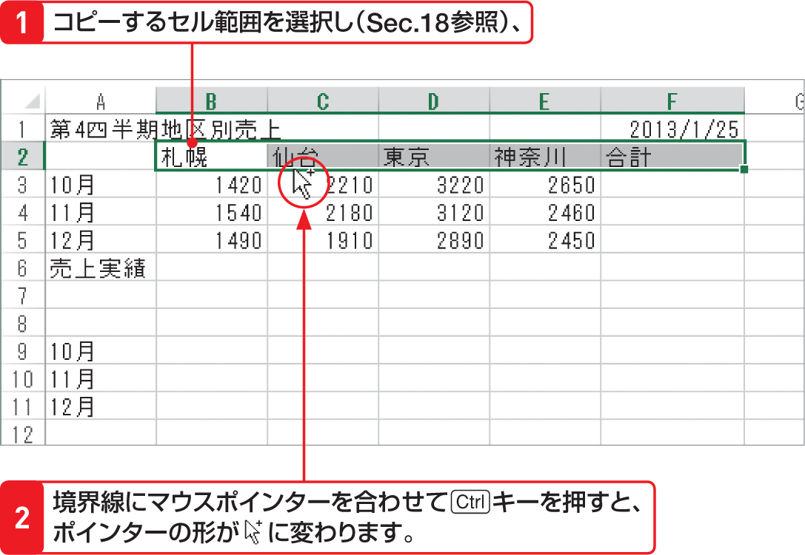

# Section 19 データをコピー・移動する

## ドラッグ操作でデータをコピーする

### [Memo] ドラッグ操作によるデータのコピー

選択したセル範囲の境界線上にマウスポインターを合わせて[key: Ctrl]キーを押すと、マウスポインターの形が  から  に変わります。この状態でドラッグすると、貼り付け先の位置を示す枠が表示されるので、目的の位置でマウスのボタンを離すと、セル範囲をコピーすることができます。
