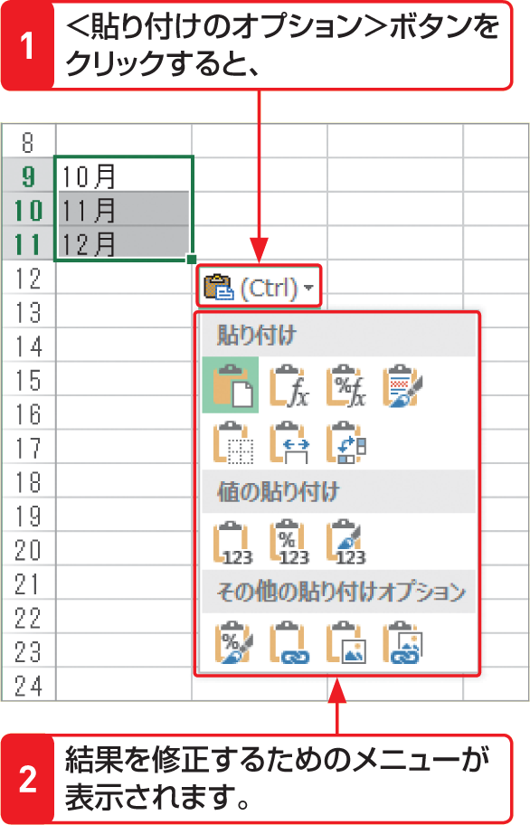

# Section 19 データをコピー・移動する

## ドラッグ操作でデータをコピーする

### [Stepup] ＜貼り付けのオプション＞ボタン

データを貼り付けた後、その結果の右下に表示される＜貼り付けのオプション＞ボタン  をクリックするか、[key: Ctrl]キーを押すと、貼り付けた後で結果を修正するためのメニューが表示されます。貼り付けるデータは、プレビューで確認することができます。

