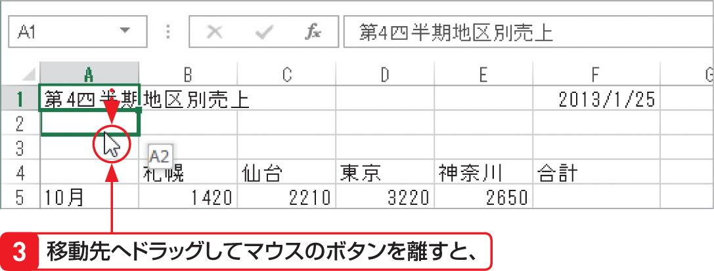
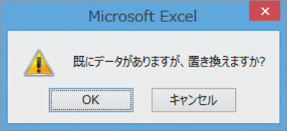

# Section 19 データをコピー・移動する

## ドラッグ操作でデータを移動する

### [Hint] ドラッグ操作でコピー・移動する際の注意点

ドラッグ操作でデータをコピー・移動すると、クリップボードにデータが保管されないため、データは一度しか貼り付けられず、＜貼り付けのオプション＞ボタン  も表示されません。  
また、移動先のセルにデータが入力されているときは、内容を置き換えるかどうかを確認する下図のようなダイアログボックスが表示されます。

