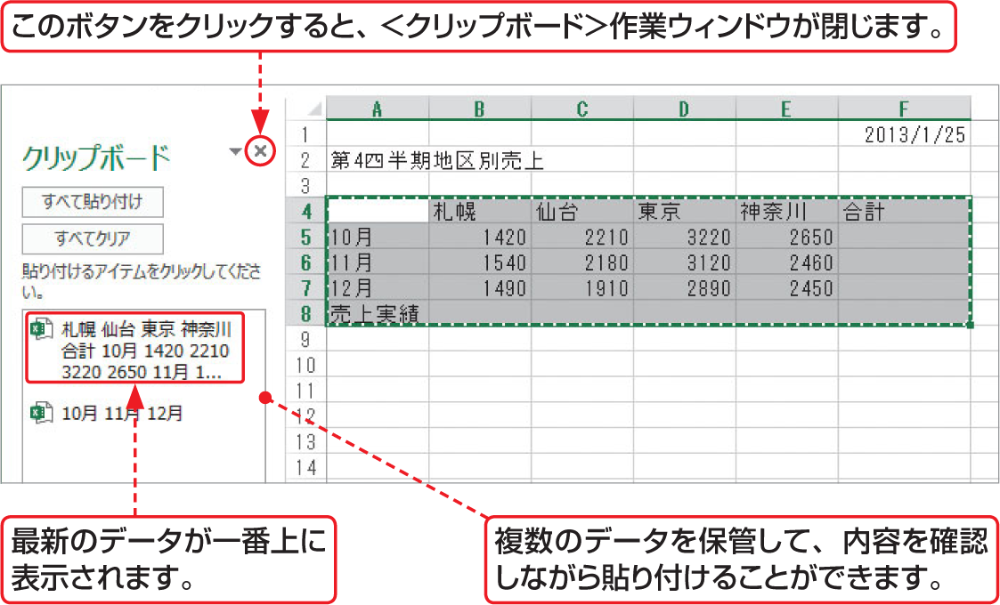

# Section 19 データをコピー・移動する

## ドラッグ操作でデータを移動する

### [Stepup] ＜クリップボード＞作業ウィンドウ

＜ホーム＞タブの＜クリップボード＞グループにある  ボタンをクリックすると、＜クリップボード＞作業ウィンドウが表示されます。これはWindowsのクリップボードとは異なる「Officeのクリップボード」です。Office 2013の各アプリケーションのデータを24個まで保管できます。

