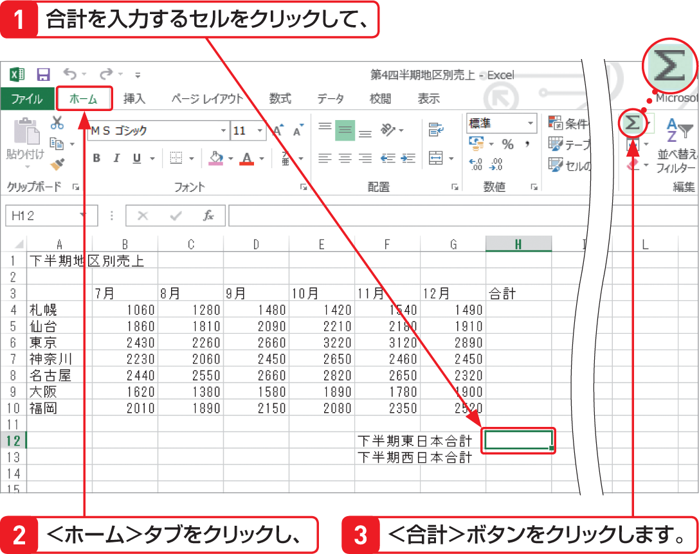

# Section 20 合計や平均を計算する

## 離れた位置にあるセルに合計を求める

### [Memo] セル範囲をドラッグして指定する

合計の対象とするデータから離れた位置にあるセルや、別のワークシートなどにあるセルに合計を求める場合は、＜合計＞ボタン  を使って対象範囲を自動設定することができません。このような場合は、左の手順のようにセル範囲をドラッグして、合計の対象とするセル範囲を指定します。
